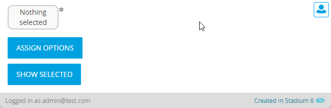
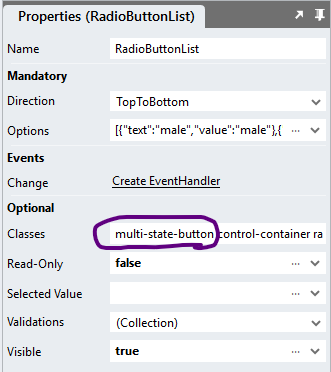

# Muti-State Button <!-- omit in toc -->

A RadioButtonList displayed as a button



# Version
Initial 1.0

# Setup

## Application Setup
1. Check the *Enable Style Sheet* checkbox in the application properties

## Page
1. Drag a *RadioButtonList* control to a page
2. Add the class "multi-state-button" to the control classes property



## CSS
The CSS below is required for the correct functioning of the module. Some elements can be [customised](#customising-css) using a variables CSS file. 

1. Create a folder called "CSS" inside of your Embedded Files in your application
2. Drag the two CSS files from this repo [*multi-state-button-variables.css*](multi-state-button-variables.css) and [*multi-state-button.css*](multi-state-button.css) into that folder
3. Paste the link tags below into the *head* property of your application
```html
<link rel="stylesheet" href="{EmbeddedFiles}/CSS/multi-state-button.css">
<link rel="stylesheet" href="{EmbeddedFiles}/CSS/multi-state-button-variables.css">
``` 

### Customising CSS
1. Open the CSS file called [*multi-state-button-variables.css*](multi-state-button-variables.css) from this repo
2. Adjust the variables in the *:root* element as you see fit
3. Overwrite the file in the CSS folder of your application with the customised file

### CSS Upgrading
To upgrade the CSS in this module, follow the [steps outlined in this repo](https://github.com/stadium-software/samples-upgrading)

## Working with Stadium Repos
Stadium Repos are not static. They change as additional features are added and bugs are fixed. Using the right method to work with Stadium Repos allows for upgrading them in a controlled manner. How to use and update application repos is described here 

[Working with Stadium Repos](https://github.com/stadium-software/samples-upgrading)